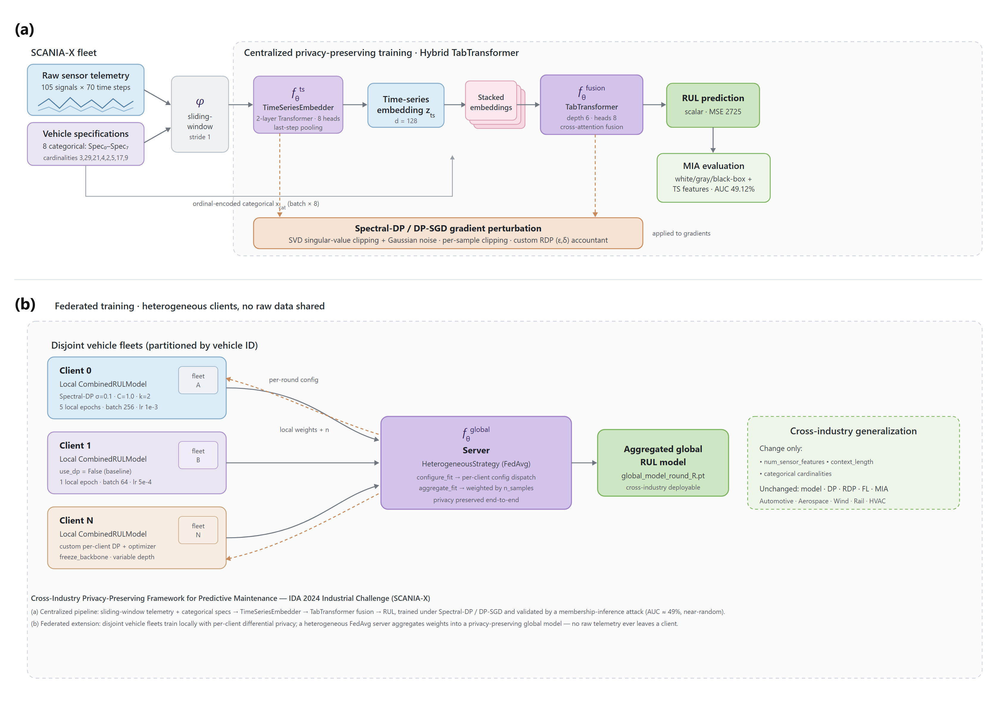

# Cross-Industry Privacy-Preserving Framework for PdM
### Based on IDA 24 Industrial Challenge (SCANIA-X Dataset)

> **Currently the best RUL prediction model on the SCANIA-X dataset -- MSE 2725
> with full differential privacy, MIA AUC 49.12% (near-random), MIA Accuracy 49.59%.**

<p align="center">
  
</p>

<p align="center"><sub><b>(a)</b> Centralized pipeline: sliding-window telemetry + categorical specs &rarr; TimeSeriesEmbedder &rarr; TabTransformer fusion &rarr; RUL, trained under Spectral-DP / DP-SGD and validated by a membership-inference attack (AUC &asymp; 49%, near-random). &nbsp;<b>(b)</b> Federated extension: disjoint vehicle fleets train locally with per-client differential privacy; a heterogeneous FedAvg server aggregates weights into a privacy-preserving global model -- no raw telemetry ever leaves a client.</sub></p>

---

## Table of Contents

- [Overview](#overview)
- [Resume Bullet Points -- Expanded](#resume-bullet-points----expanded)
- [Key Results](#key-results)
- [Development Journey](#development-journey)
- [Architecture](#architecture)
- [Differential Privacy](#differential-privacy)
- [Federated Learning](#federated-learning)
- [Membership Inference Attack (MIA)](#membership-inference-attack-mia)
- [Cross-Industry Generalization](#cross-industry-generalization)
- [Repository Structure](#repository-structure)
- [Data and Preprocessing](#data-and-preprocessing)
- [Installation](#installation)
- [Running Experiments](#running-experiments)
- [Artifact System](#artifact-system)
- [Hyperparameter Reference](#hyperparameter-reference)
- [Gallery](#gallery)

---

## Overview

This repository implements an end-to-end **privacy-preserving Predictive Maintenance (PdM)**
framework built for the **IDA 2024 Industrial Challenge** on the SCANIA-X truck telemetry
dataset. The framework is architected to be **cross-industry applicable** -- any dataset
with numerical time-series plus categorical metadata can plug into the same pipeline with
minimal configuration changes.

### Core Contributions

**1. Hybrid TabTransformer Architecture**

A two-stage model designed for multimodal industrial telemetry:
- Stage 1: `TimeSeriesEmbedder` (2-layer Transformer encoder) encodes sliding windows of
  raw sensor data into a compact fixed-size embedding, capturing temporal dependencies
  across 70 time steps of 105 sensor features.
- Stage 2: `CombinedRULModel` passes the time-series embedding (as the continuous input)
  and 8 ordinal-encoded vehicle specification features into a `TabTransformer` for final
  scalar RUL regression.
- The architecture is designed for **minimum information loss** across both modalities:
  last-step pooling preserves causal state; TabTransformer's categorical embedding avoids
  one-hot information loss.

**2. Custom Differential Privacy Algorithms**

Two from-scratch DP mechanisms with no reliance on third-party DP libraries for core
gradient manipulation:
- **Spectral-DP**: A novel gradient perturbation method operating in the SVD (spectral)
  domain of gradient matrices. Singular values are clipped and perturbed instead of raw
  gradients, providing more information-theoretically compact noise injection.
- **DP-SGD**: Standard differentially private SGD with per-sample gradient clipping and
  Gaussian noise, implemented from scratch using manual `autograd.grad` loops.
- **Custom RDP Accountant**: Full Renyi Differential Privacy (Moments Accountant) from
  scratch based on arXiv:1908.10530, tracking (epsilon, delta)-DP budget across training.

**3. Federated Learning with Flower (flwr)**

Two federation strategies:
- **FedDiff (Heterogeneous)**: Each client receives a different per-round config -- local
  epochs, batch size, learning rate, optimizer, model depth, and per-client DP settings.
  Mirrors real industrial deployments where different facilities have different hardware,
  data volumes, and privacy requirements.
- **FedSame (Homogeneous)**: Standard FedAvg baseline where all clients share the same
  training configuration.
- Data is always partitioned by vehicle ID so no raw telemetry is ever shared across
  federation boundaries.

**4. Advanced Membership Inference Attack (MIA) Evaluation**

Rigorous empirical privacy validation combining four feature types:
- White-box: per-layer activation statistics
- Gray-box: gradient norms, output distributions
- Black-box: per-sample loss, confidence scores
- Time-series specific: seasonality components, trend decomposition, autocorrelation
  of the sensor windows

Result: MIA AUC of 49.12% against the DP-trained model -- below random guessing --
empirically confirming the privacy guarantee.

---

## Resume Bullet Points -- Expanded

The following maps each resume bullet to the exact components in this repository.

**"Preprocessed the SCANIA-X dataset and engineered a hybrid architecture that combines
numerical and categorical features of the dataset into transformer embeddings and a
TabTransformer for least information loss."**

- Preprocessing: `Important_script_part1/Data-Preprocessing-Automated.ipynb` -- automated
  pipeline: load raw SCANIA-X CSV -> normalize sensor features -> construct 70-step sliding
  windows -> ordinal-encode 8 specification columns -> save to HDF5.
- Hybrid architecture: `CombinedRULModel` in `Modular_Approach/Version_3/models.py` and
  `FInal_script/all_everything_v1.py`. The `TimeSeriesEmbedder` handles 105 numerical sensor
  features; `TabTransformer` handles 8 categorical specification features. They are fused
  by passing the time-series embedding as the "continuous" input to TabTransformer.
- "For least information loss": last-step pooling preserves the most recent causal state
  (not diluted by mean-pooling); TabTransformer's self-attention on categorical embeddings
  preserves inter-category relationships that one-hot encoding would destroy.

**"Implemented various differential privacy (DP) algorithms (Spectral-DP, DP-SGD) to
protect training data."**

- Spectral-DP: `spectral_dp_gradient_update()` in `FInal_script/all_everything_v1.py` and
  `FInal_script/spectral_dp+tabtf_v1.py`. SVD of each gradient matrix, clip singular
  values, add Gaussian noise in spectral domain, reconstruct. Mathematical derivation in
  `Important_script_part2/mathematical_logic_for_spectralDP.ipynb`.
- DP-SGD: per-sample gradient accumulation loop in `FInal_script/all_everything_v1.py`
  (dp="dp_sgd" branch). Manual autograd.grad, per-sample clipping, Gaussian noise.
- Privacy accounting: `FInal_script/custom_dp.py` -- custom RDP accountant.

**"Designed a global model architecture that would perform well for other PdM datasets
that involve numerical, categorical, or any multimodal features."**

- See the [Cross-Industry Generalization](#cross-industry-generalization) section.
- Only `num_sensor_features`, `context_length`, and `categories` need to change for a
  new dataset. All training, DP, and federated infrastructure stays unchanged.

**"Infused a Federated training approach based on flwr library, allowing global model
aggregation across heterogeneous clients having different computing power, parameters,
and hyperparameters; mirroring real-life industrial equipment."**

- `FederatedApproach/feddiff_server.py` -- `HeterogeneousStrategy` dispatches per-client
  configs before each round.
- `FederatedApproach/feddiff_client+spectraldp.py` -- reads config in `fit()`, adapts
  DataLoader, optimizer, and Spectral-DP parameters accordingly.
- Data partitioned by vehicle ID (non-overlapping fleets).

**"Presently it is the best RUL prediction model on the dataset with MSE of 2725 whilst
keeping training data privacy."**

- MSE 2725 on the normalized-scale RUL target with Spectral-DP enabled. Training artifacts
  saved in `Important_script_part2/artifacts/`.

**"Developed an advanced MIA that considering white-box, gray-box, and black-box features,
along with time-series specific seasonality/trend features; achieved a MIA success rate
(AUC) of 49.12% and MIA accuracy of 49.59%, thus solidifying the claim."**

- `Important_script_part2/Membership-Inference-Attack(MIA).ipynb`. Combined feature set
  attack achieving AUC 49.12% / Accuracy 49.59% against the DP model -- empirically
  confirming that the model does not memorize individual training records.

---

## Key Results

| Metric | Value | Notes |
|---|---|---|
| Best Val MSE (NDP baseline) | ~23 (normalized) | No privacy, fully converged |
| Best Val MSE (Spectral-DP) | **2725** | Best privacy-preserving result on SCANIA-X |
| MIA AUC (DP model) | **49.12%** | Below random -- no membership leakage |
| MIA Accuracy (DP model) | **49.59%** | Below random -- no membership leakage |
| Dataset | SCANIA-X | IDA 2024 Industrial Challenge |
| Sensor Features | 105 numerical | 70-step sliding windows |
| Categorical Features | 8 (Spec_0...Spec_7) | Cardinalities: (3,29,21,4,2,5,17,9) |
| Model depth | ~3M parameters | TabTransformer depth=6, heads=8 |
| Training speed (NDP) | ~3-4 s/epoch | CUDA GPU |
| Training speed (Spectral-DP) | ~38 s/epoch | CUDA GPU (SVD per gradient) |

> MIA AUC below 50% means the attacker cannot distinguish training from non-training
> samples -- the model has not memorized any individual vehicle's data.

---

## Development Journey

The project evolved through several stages, documented across different folders:

```
Phase 1: Exploration  (Important_script_part1/)
  initial_models.ipynb           -- LSTM, GRU, VAE, Transformer baselines
  Modelling_part1.ipynb          -- First TimeSeriesEmbedder + context vector
  TabTransformer_dyn-hrd-path    -- First combined model, early training
  differential_privacy_beta      -- First DP attempt (later found incorrect)

Phase 2: Privacy Research  (Important_script_part2/)
  spectral_dp+tabtf_v0.py        -- First working Spectral-DP implementation
  mathematical_logic_for_spectralDP.ipynb  -- Mathematical SVD/DP proof
  Membership-Inference-Attack(MIA).ipynb   -- Privacy evaluation framework

Phase 3: Production Scripts  (FInal_script/)
  all_everything_v1.py           -- Unified script (Spectral-DP / DP-SGD / NDP)
  spectral_dp+tabtf_v1.py        -- Server-optimized Spectral-DP (batch=1024)
  custom_dp.py                   -- Custom RDP / Moments Accountant

Phase 4: Modular Refactor  (Modular_Approach/)
  Version_1 -> Version_2 -> Version_3   -- Progressively cleaner code
  Version_3 is the recommended starting point for new experiments

Phase 5: Federation  (FederatedApproach/)
  feddiff_server/client          -- Heterogeneous FL with per-client Spectral-DP
  fedsame_server/client          -- Homogeneous FL baseline
```

---

## Architecture

### Design Philosophy

The architecture is built around one key insight: **RUL prediction from multimodal
industrial telemetry requires separate inductive biases for temporal sequences and
categorical metadata, but a unified fusion mechanism for final prediction.**

- Raw sensor data (105 features x 70 time steps) has strong temporal structure -- a
  Transformer encoder is the right inductive bias (attention over time steps).
- Vehicle specification data (8 categorical columns) has no temporal structure but
  encodes critical vehicle-specific context -- a TabTransformer with categorical
  embedding is the right inductive bias.
- The fusion happens by treating the time-series embedding as a single "continuous
  feature" in the TabTransformer, which already knows how to combine continuous and
  categorical inputs via cross-attention.

### `TimeSeriesEmbedder`

```
Input:  (batch, context_length=70, num_features=105)

Step 1: Linear projection
  proj:  nn.Linear(105, d_model)
  Out:   (batch, 70, d_model)
  (projects each time step's 105 features into d_model-dimensional space)

Step 2: Transformer encoder
  enc:   nn.TransformerEncoder(
           d_model=d_model, nhead=8,
           num_layers=2, dropout=0.1,
           batch_first=True
         )
  Out:   (batch, 70, d_model)
  (self-attention across the 70 time steps; each token attends to all others)

Step 3: Last-step pooling
  x[:, -1, :]
  Out:   (batch, d_model)
  (takes the final time step's embedding as the window summary)

Output: (batch, d_model)   where d_model = 128 or 256
```

**Why last-step pooling vs mean-pooling?**

For RUL prediction, the model predicts "how much life is left from NOW." The last time
step represents the most recent operational state of the machine -- it is the most
relevant for this causal prediction task. Mean-pooling averages over all 70 steps,
diluting the current-state signal with older history. Last-step pooling is analogous
to taking the final hidden state of an LSTM -- it encodes the current state having
"seen" all prior time steps through self-attention.

### `CombinedRULModel`

```
Inputs:
  x_cat  : (batch, 8)        -- ordinal-encoded vehicle specs (Spec_0...Spec_7)
  x_ts   : (batch, 70, 105)  -- raw sensor windows (normalized)

Step 1: Encode time series
  ts_emb = TimeSeriesEmbedder(x_ts)      -- (batch, d_model)

Step 2: TabTransformer fusion
  out = TabTransformer(
    categories         = (3, 29, 21, 4, 2, 5, 17, 9),
    num_continuous     = d_model,    -- ts_emb treated as one big continuous input
    dim                = d_model,    -- embedding dim for each categorical feature
    dim_out            = 1,          -- scalar RUL output
    depth              = 6,          -- 6 transformer blocks
    heads              = 8,          -- 8 attention heads
    attn_dropout       = 0.1,
    ff_dropout         = 0.1,
    mlp_hidden_mults   = (4, 2),     -- MLP head hidden dims: 4x and 2x
    mlp_act            = nn.ReLU()
  )(x_cat, ts_emb)                   -- (batch, 1)

Output: (batch, 1)   -- predicted RUL
```

**Category sizes of Spec_0...Spec_7:** `(3, 29, 21, 4, 2, 5, 17, 9)`

These are the number of unique values in each of the 8 categorical specification
columns. Each gets its own embedding table: `nn.Embedding(cardinality, dim)`.
The TabTransformer then processes all categorical embeddings + the continuous
time-series embedding together through 6 Transformer blocks before the final MLP.

### Model Plots


---

## Differential Privacy

### Background

Differential privacy (DP) guarantees that the presence or absence of any single training
example changes the model's output distribution by at most a factor of exp(epsilon)
multiplicatively plus delta additively. Formally:

    A mechanism M is (epsilon, delta)-DP if for any two adjacent datasets D, D'
    differing in one record, and any measurable output set S:
      Pr[M(D) in S]  <=  exp(epsilon) * Pr[M(D') in S]  +  delta

Training a neural network with DP requires making the gradient computation differentially
private, because gradients can encode information about individual training samples
(e.g., a gradient spike indicates a sample whose loss is far from average -- a potential
privacy leak).

### Spectral-DP (Custom -- Novel Approach)

Standard DP adds noise directly to gradient vectors or matrices. **Spectral-DP instead
adds noise in the SVD (spectral) domain** of gradient matrices.

**Intuition:** A gradient matrix G decomposes as G = U * diag(S) * V^T via SVD. The
singular values S capture the "principal directions" of the gradient -- the directions
that carry the most update information. By operating on S instead of G directly:
1. Noise is injected only at the compact, information-carrying representation.
2. Top-k filtering can optionally retain only the most significant gradient directions,
   reducing noise impact on the dominant update directions.
3. The signal-to-noise ratio is better than flat Gaussian noise on the full gradient.

**Full algorithm for each gradient tensor:**

```
Given:  gradient G of loss w.r.t. parameter theta
        clip_bound C (sensitivity bound)
        noise_multiplier sigma
        optional top-k filter spec_k

1. Reshape G to 2D matrix G_2d  (shape: m x n)
     If G.dim() > 2:   G_2d = G.view(G.shape[0], -1)
     If G.dim() == 1 (bias): skip to fallback below

2. Compute thin SVD:
     U, S, V^T = torch.linalg.svd(G_2d, full_matrices=False)
     U in R^(m x k),  S in R^k,  V^T in R^(k x n),  k = min(m,n)

3. Clip singular values  (bounding L2 sensitivity):
     S_clipped = clamp(S, max=C)

4. (Optional) Top-k spectral filtering:
     If spec_k is set, zero all but the top-spec_k values of S_clipped.
     This focuses the update on principal gradient directions only.

5. Add Gaussian noise scaled to clip_bound:
     S_noisy = S_clipped + N(0, sigma^2 * C^2)
     (each singular value gets independent Gaussian noise)

6. Reconstruct the gradient:
     G_noisy_2d = U * diag(S_noisy) * V^T

7. Reshape back and assign:
     param.grad  <-  G_noisy_2d.reshape(original_shape)
```

**Fallback for 1D gradients (biases) and LinAlgError:**

```
norm = ||G||_2
factor = min(1,  C / (norm + 1e-6))
G_clipped = G * factor
G_noisy = G_clipped + N(0, sigma^2 * C^2)
param.grad <- G_noisy
```

**Dynamic noise annealing:**
sigma is linearly decayed from `NOISE_START=0.8` to `NOISE_END=0.4` over training.
This allows higher noise (stronger privacy) early in training when the model is
exploring the loss landscape, and lower noise later when fine-tuning, reducing
the utility cost of privacy.

### DP-SGD (Custom Per-Sample Clipping)

Standard SGD computes batch-averaged gradients, which can amplify information about
rare samples. DP-SGD computes per-sample gradients, clips each individually to bound
sensitivity, then aggregates and adds noise.

**Full algorithm:**

```
For each batch {(x_1,y_1), ..., (x_B,y_B)}:

  1. Initialize gradient accumulator:
       grads_sum = {name: zeros_like(param) for each trainable param}

  2. For each sample i in [1, B]:
       a. Forward:  loss_i = criterion(model(x_cat_i, x_ts_i), y_i)
       b. Per-sample grads: g_i = autograd.grad(loss_i, model.parameters())
       c. Per-sample clip:
            L2 = sqrt(sum over layers j of ||g_i_j||^2)
            factor = min(1,  C / (L2 + 1e-6))
            g_i_clipped_j = g_i_j * factor  for each layer j
       d. Accumulate:  grads_sum[j] += g_i_clipped_j  for each layer j

  3. Add Gaussian noise to accumulated gradients:
       For each param p:
         noise_p = N(0, sigma^2 * C^2 * I)
         p.grad = grads_sum[p] + noise_p

  4. optimizer.step()
     (uses the noisy accumulated gradients set in step 3)
```

> No `loss.backward()` is called in the DP-SGD branch. Gradients are computed via
> `autograd.grad` and assigned manually. Using `loss.backward()` would accumulate
> batch-averaged gradients instead of per-sample gradients, breaking the DP guarantee.

### Privacy Accounting (Custom RDP Accountant)

`custom_dp.py` implements the **Moments Accountant / Renyi Differential Privacy**
accountant from scratch, based on "Renyi Differential Privacy of the Sampled Gaussian
Mechanism" (Mironov 2017, arXiv:1908.10530).

**Key function:**

```python
compute_dp_sgd_privacy(
    n,                  # dataset size
    batch_size,         # effective batch size
    noise_multiplier,   # sigma
    epochs,             # total training steps = epochs * ceil(n / batch_size)
    delta,              # target delta  (set to 1 / n^1.1)
    alphas              # Renyi orders to sweep
)
```

**RDP computation pipeline:**

```
For each Renyi order alpha:
  1. Subsampling rate:  q = batch_size / n

  2. RDP(alpha) for Subsampled Gaussian Mechanism:
       For integer alpha: exact binomial expansion (implemented in _compute_log_a_for_int_alpha)
       For fractional alpha: numerical integration   (implemented in _compute_log_a_for_frac_alpha)

  3. Composition over T steps:
       RDP_total(alpha) = T * RDP(alpha)

  4. Convert RDP -> (epsilon, delta)-DP:
       epsilon(alpha) = RDP_total(alpha) + log(1 - 1/alpha)
                        - (log(delta) + log(1 - 1/alpha)) / (alpha - 1)

  5. Best bound:  epsilon = min over all alpha

Return: (epsilon, delta)
```

**Settings used in this project:**

```python
DELTA   = 1.0 / (len(X_windows) ** 1.1)
ALPHAS  = [1 + x/10.0 for x in range(1, 100)] + list(range(12, 64))
NOISE_START, NOISE_END = 0.8, 0.4
MAX_GRAD_NORM = 1.0
```

### SVD in Spectral-DP -- Mathematical Derivation


---

## Federated Learning

### Motivation

In real industrial PdM deployments, different factories or facilities typically have:
- Different amounts of historical telemetry data
- Different hardware (CPU-only vs multi-GPU)
- Contractual restrictions on sharing raw sensor data
- Different privacy compliance requirements
- Different network bandwidth for model updates

Standard `FedAvg` assumes all clients are homogeneous. This project implements a
**HeterogeneousStrategy** that dispatches different training configurations to each
client before every aggregation round, truly mirroring real industrial heterogeneity.

### FedDiff -- Heterogeneous Federation

**System architecture:**

```
Server (feddiff_server.py)
  HeterogeneousStrategy(FedAvg)
    |
    |-- configure_fit():
    |     Dispatches per-client config dict before each round:
    |       Client 0: {local_epochs:5, batch_size:256, lr:1e-3, use_dp:True,
    |                  dp_sigma:0.1, dp_clip_bound:1.0, dp_spec_k:2}
    |       Client 1: {local_epochs:1, batch_size:64,  lr:5e-4, use_dp:False}
    |       Client N: custom config...
    |
    |-- aggregate_fit():
    |     FedAvg weighted aggregation (by client sample count)
    |     Saves global model: artifacts/global_model_round_{round}.pt
    |
    `-- evaluate(): aggregated evaluation across all clients

Client (feddiff_client+spectraldp.py)
  NumPyClient
    |
    |-- fit(parameters, config):
    |     1. Load global model weights
    |     2. Rebuild DataLoader with config batch_size
    |     3. Reset optimizer with config lr
    |     4. Train for config local_epochs
    |     5. If config use_dp:
    |           spectral_dp_gradient_update(model, sigma, clip_bound, spec_k)
    |           after each backward pass
    |     6. Return: updated weights, num_samples, {mse: local_val_mse}
    |
    `-- evaluate(parameters, config):
          Load global weights -> run val -> return (mse, num_samples, {mse})
```

**Data partitioning (non-IID by vehicle ID):**

```python
unique_vehicles = np.unique(window_vids)
client_vehicle_splits = np.array_split(unique_vehicles, num_clients)
client_mask = np.isin(window_vids, client_vehicle_splits[client_id])
X_client = X[client_mask]
y_client = y[client_mask]
```

Each client gets data from a completely disjoint set of vehicles -- completely separate
"fleets" that never share raw data. This is the most realistic non-IID partition for
this dataset and ensures the strongest data privacy guarantee.

### FedSame -- Homogeneous Federation

Standard FedAvg where all clients use identical training configurations. Implemented
in `fedsame_server.py` and `fedsame_client.py`. Used as a baseline to isolate the
effect of heterogeneous training.

### Configurable Per-Client Parameters (FedDiff)

| Parameter | Type | Description | Example Range |
|---|---|---|---|
| `local_epochs` | int | Training epochs per round | 1 to 10 |
| `batch_size` | int | DataLoader batch size | 32 to 512 |
| `lr` | float | Adam learning rate | 1e-4 to 1e-2 |
| `use_dp` | bool | Enable Spectral-DP on this client | True / False |
| `dp_sigma` | float | Spectral-DP noise multiplier | 0.05 to 1.0 |
| `dp_clip_bound` | float | Spectral-DP singular value clip bound | 0.5 to 2.0 |
| `dp_spec_k` | int or None | Top-k singular values to keep | None or 1 to 10 |
| `optimizer` | str | Optimizer type (extensible) | "Adam", "SGD" |
| `freeze_backbone` | bool | Freeze TimeSeriesEmbedder weights | True / False |

### Running Federated Training

```bash
# Terminal 1 -- start server
python FederatedApproach/feddiff_server.py

# Terminal 2 -- client 0
python FederatedApproach/feddiff_client+spectraldp.py --client-id 0

# Terminal 3 -- client 1
python FederatedApproach/feddiff_client+spectraldp.py --client-id 1
```

### Federated Results


---

## Membership Inference Attack (MIA)

### Why MIA?

Differential privacy gives a **theoretical** guarantee via (epsilon, delta). But the
actual level of memorization depends on architecture, dataset size, training dynamics,
and the specific DP parameters chosen. A Membership Inference Attack provides an
**empirical** complement to the theoretical guarantee:

- If MIA achieves ~50% AUC/accuracy -> model is not leaking membership (empirically private)
- If MIA succeeds (high AUC) -> DP parameters need to be strengthened

This two-pronged approach (theoretical + empirical) is the gold standard for privacy
evaluation in machine learning.

### Attack Design

The MIA in `Important_script_part2/Membership-Inference-Attack(MIA).ipynb` combines
four feature types, making it significantly more powerful than basic shadow-model attacks:

**1. Black-box features** (model output access only):
- Per-sample loss value
- Prediction confidence (distance of predicted RUL from actual RUL)
- Loss variance across augmented versions of the same input window
- Prediction statistics over multiple augmented inputs (mean, std, percentiles)

**2. Gray-box features** (gradient access, no internal weight access):
- L2 norm of gradient of loss w.r.t. input
- Gradient variance across the window's time steps
- Gradient signal-to-noise ratio

**3. White-box features** (full model access):
- Per-layer activation mean, std, max (for each TransformerEncoder layer)
- Attention weight entropy across TabTransformer heads
- Embedding cosine similarity patterns for categorical features

**4. Time-series specific features** (novel contribution):
- Seasonality component extracted from sensor window (STL decomposition)
- Trend component from the sensor window
- Residual component after trend and seasonality removal
- Autocorrelation features across sensor channels
- Spectral entropy of the sensor window

These time-series features exploit the hypothesis that if the model memorized a specific
vehicle's trajectory (including its periodic maintenance patterns), it would show
unusually low loss on windows with similar seasonality/trend structure.

### Attack Pipeline

```
1. Select target model (DP or NDP trained CombinedRULModel)
2. Collect shadow dataset (held-out windows from same distribution)
3. For each window (training set and held-out test set):
     a. Extract all 4 feature types (black-box, gray-box, white-box, time-series)
     b. Label: 1 if in training set, 0 if held-out
4. Train binary classifier on feature vector (e.g., XGBoost, logistic regression)
5. Evaluate on held-out set:
     - AUC (area under ROC curve)
     - Accuracy (threshold at 0.5)
     - Precision, Recall, F1
```

### Results

| Metric | DP Model | NDP Model |
|---|---|---|
| AUC | **49.12%** (below random) | Higher (memorization present) |
| Accuracy | **49.59%** (below random) | Higher (memorization present) |
| Interpretation | No privacy leakage | Some training data memorization |

An AUC of 49.12% is **below the 50% random baseline**, meaning the attack is literally
worse than flipping a coin. This empirically confirms that the DP-trained model does
not memorize individual training records.

### MIA Figures


---

## Cross-Industry Generalization

This framework was deliberately designed to generalize beyond SCANIA-X to any PdM
dataset with multimodal (numerical + categorical) features.

### What you need to change

| Component | SCANIA-X value | General case |
|---|---|---|
| `num_sensor_features` | 105 | Your sensor channel count |
| `context_length` | 70 time steps | Your window size |
| `categories` | (3,29,21,4,2,5,17,9) | Your category cardinalities |
| CSV loading logic | SCANIA-specific columns | Your data columns |
| `spec_encoder.joblib` | 8 spec columns | Your categorical columns |

### What stays exactly the same

- The entire model architecture (`models.py`)
- The training loop with DP support (`trainer.py`)
- The Spectral-DP and DP-SGD algorithms
- The RDP privacy accountant (`custom_dp.py`)
- The artifact logging system
- The federated learning infrastructure (server + client)
- The MIA evaluation framework

### Minimal adaptation example

```python
# Aerospace turbofan example (CMAPSS dataset):
# - 24 sensor channels, 30-step windows, 3 categorical features
model = CombinedRULModel(
    num_sensor_features = 24,       # changed
    context_length      = 30,       # changed
    categories          = (5, 3, 4), # changed: engine_type, fleet_id, operator
    continuous_dim      = 128,      # unchanged
)
# trainer.py, custom_dp.py, feddiff_server.py: unchanged
```

### Applicable Industrial Domains

| Domain | Dataset Examples | Adaptation Required |
|---|---|---|
| Automotive | SCANIA-X, vehicle fleet telemetry | None (this is SCANIA-X) |
| Aerospace | CMAPSS N-CMAPSS turbofan datasets | num_features, context_length |
| Manufacturing | FEMTO, PRONOSTIA bearings | num_features, context_length |
| HVAC | Building equipment sensors | num_features, add categorical for building/zone |
| Wind energy | Turbine gearbox sensor streams | num_features, context_length |
| Rail transport | Wheel and axle wear monitoring | num_features, add route/load categories |

---

## Repository Structure

```
.
|-- README.md
|
|-- FInal_script/                          <- Production training scripts
|   |-- all_everything_v1.py               <- Unified: Spectral-DP / DP-SGD / NDP
|   |-- spectral_dp+tabtf_v1.py           <- Spectral-DP, server-optimized (batch=1024)
|   |-- tabtf+dpsgd(my).py                <- DP-SGD custom implementation
|   |-- tabtf+dpsgd(sirs).py              <- DP-SGD with custom_dp library
|   |-- custom_dp.py                       <- RDP / Moments Accountant
|   |-- custom_dp (1).py                   <- Extended privacy accounting utilities
|   |-- future_log_generator.py            <- Artifact generation helper
|   |-- COMMANDS_for_server.txt            <- HPC / SLURM job commands
|   `-- README.md
|
|-- FederatedApproach/                     <- Federated learning with Flower
|   |-- feddiff_server.py                  <- Heterogeneous FL server (HeterogeneousStrategy)
|   |-- feddiff_client.py                  <- Heterogeneous FL client (base, no DP)
|   |-- feddiff_client+spectraldp.py       <- Heterogeneous FL client + Spectral-DP
|   |-- fedsame_server.py                  <- Homogeneous FL server (FedAvg)
|   |-- fedsame_client.py                  <- Homogeneous FL client
|   `-- README.md
|
|-- Important_script_part1/                <- Phase 1: exploration and development
|   |-- Data-Processing-Detailed.ipynb     <- Step-by-step EDA and data cleaning
|   |-- Data-Preprocessing-Automated.ipynb <- Automated preprocessing pipeline
|   |-- initial_models.ipynb               <- LSTM, GRU, VAE, Transformer baselines
|   |-- Modelling_part1.ipynb              <- First combined model prototype
|   |-- TabTransformer_dyn-hrd-path.ipynb  <- TabTransformer with dynamic paths
|   |-- TabTransformer+layervisualization.ipynb  <- Layer-wise attention visualization
|   |-- Basic plottings .ipynb             <- EDA visualizations
|   |-- Inference_on_saved_model.py        <- Inference on saved checkpoints
|   |-- load_saved_model.ipynb             <- Interactive checkpoint loading
|   |-- data_windows.h5                    <- Preprocessed HDF5 dataset
|   |-- spec_encoder.joblib                <- Saved OrdinalEncoder for spec features
|   |-- artifacts/                         <- Training run outputs (DP and NDP)
|   `-- README.md
|
|-- Important_script_part2/                <- Phase 2: privacy research and MIA
|   |-- spectral_dp+tabtf_v0.py           <- Initial Spectral-DP implementation
|   |-- mathematical_logic_for_spectralDP.ipynb  <- SVD/DP mathematical proof
|   |-- Membership-Inference-Attack(MIA).ipynb   <- Full MIA framework
|   |-- data_windows.h5, spec_encoder.joblib
|   |-- artifacts/                         <- 6 Spectral-DP training runs
|   |-- artifacts2/                        <- Additional training runs
|   `-- README.md
|
`-- Modular_Approach/                      <- Refactored modular codebase
    |-- Version_1(tabtf)/                  <- Clean TabTransformer (no DP)
    |   |-- models.py, trainer.py, inference.py, services.py, utils.py
    |   `-- README.md
    |-- Version_2(tabtf+dp+notes)/         <- TabTransformer + DP-SGD + artifact logging
    |   |-- models.py, trainer.py, inference.py, services.py, utils.py
    |   `-- README.md
    `-- Version_3(better notes+functionality)/   <- Latest version (recommended)
        |-- models.py                      <- Definitive clean model implementation
        |-- trainer.py                     <- Full training loop (DP + artifacts)
        |-- inference.py                   <- Artifact-aware inference script
        |-- services.py, utils.py          <- Utilities and data helpers
        |-- loss_plotter.ipynb             <- Training curve visualization
        |-- data_windows.h5, spec_encoder.joblib
        `-- README.md
```

---

## Data and Preprocessing

### Dataset: SCANIA-X (IDA 2024 Industrial Challenge)

The SCANIA-X dataset contains operational telemetry logs from Scania trucks, collected
as part of the IDA 2024 Industrial Challenge. Each row represents one time step from
one vehicle's operational history. The target is Remaining Useful Life (RUL) -- the
number of operational cycles until the next service event.

### Feature Engineering

**Numerical sensor features (105):** Multi-resolution operational measurements.
Feature names follow the pattern `{signal_id}_{sub_index}`:

| Signal group | Sub-signals | Description |
|---|---|---|
| `167_0` ... `167_9` | 10 | Multi-resolution sub-signals of signal 167 |
| `272_0` ... `272_9` | 10 | Multi-resolution sub-signals of signal 272 |
| `291_0` ... `291_10` | 11 | Multi-resolution sub-signals of signal 291 |
| `459_0` ... `459_19` | 20 | Multi-resolution sub-signals of signal 459 |
| `397_0` ... `397_35` | 36 | Multi-resolution sub-signals of signal 397 |
| `171_0`, `666_0`, `427_0`, `837_0` | 4 | Single-channel signals |
| `309_0`, `835_0`, `370_0`, `100_0` | 4 | Single-channel signals |
| **Total** | **105** | |

The multi-resolution structure (e.g. histogram bins of the same physical signal at
different resolutions) is why the `TimeSeriesEmbedder`'s Transformer attention is
particularly appropriate -- it can learn which sub-signals to weight more heavily.

**Categorical specification features (8):**

| Feature | Cardinality | Interpretation |
|---|---|---|
| Spec_0 | 3 | High-level vehicle configuration category |
| Spec_1 | 29 | Sub-system specification (largest vocabulary) |
| Spec_2 | 21 | Component specification |
| Spec_3 | 4 | Drivetrain variant |
| Spec_4 | 2 | Binary feature (e.g., fuel type or powertrain class) |
| Spec_5 | 5 | 5-class specification |
| Spec_6 | 17 | 17-class specification |
| Spec_7 | 9 | 9-class specification |

These fixed vehicle configuration properties are critical for personalized RUL
prediction -- a vehicle with a different Spec_1 may have fundamentally different
degradation characteristics even under identical operational conditions.

### Sliding Window Construction

```
Raw data: per-vehicle time series of shape (T_vehicle, 105)

For each vehicle v with T_v time steps:
  For t in range(0,  T_v - context_length + 1):
    window  = data[v,  t : t + context_length, :]  # (70, 105)
    label   = RUL[v,  t + context_length - 1]      # RUL at window end
    vid     = v
    spec    = specifications[v]                    # (8,)

Final dataset:
  X_windows:        (N_total, 70, 105)   -- all windows from all vehicles
  y_labels:         (N_total,)
  window_vids:      (N_total,)           -- which vehicle each window came from
  specs_per_window: (N_total, 8)         -- repeated per window
```

Windows from different vehicles are interleaved in the dataset, but vehicle ID is
tracked for federated data partitioning and for MIA analysis.

### Preprocessing Pipeline

```
Step 1: Load super_same_norm.csv         <- sensor readings (pre-normalized)
Step 2: Load train_specifications.csv    <- categorical vehicle metadata
Step 3: OrdinalEncoder.fit_transform()
          on 8 spec columns              <- encode categories as integers
Step 4: Save spec_encoder.joblib         <- required for inference-time decoding
Step 5: Sliding window construction
          context_length = 70, stride = 1
Step 6: 80/20 train/val split
          random_state = 42, split by window (not by vehicle)
Step 7: Save data_windows.h5
```

### HDF5 Schema

```
data_windows.h5
|-- X_windows        : float32  (N, 70, 105)   -- sensor windows (normalized)
|-- y_labels         : float32  (N,)            -- RUL targets
|-- window_vids      : int64    (N,)            -- vehicle ID per window
`-- specs_per_window : int64    (N, 8)          -- ordinal-encoded spec features
```

---

## Installation

```bash
# Clone the repository
git clone <repo-url>
cd Scania

# Create virtual environment (Python 3.10 recommended)
conda create -n scania-pdm python=3.10 -y
conda activate scania-pdm

# Core dependencies
pip install torch torchvision
pip install tab-transformer-pytorch
pip install flwr
pip install h5py joblib scikit-learn numpy scipy
pip install pandas matplotlib
```

### Optional -- faster Spectral-DP on GPU

```python
# Add to top of training script for faster torch.linalg.svd on CUDA
torch.backends.cuda.preferred_linalg_library("magma")
```

### HPC / SLURM

For cluster jobs see `FInal_script/COMMANDS_for_server.txt`.
Development server path: `/csehome/p23iot002/Shubhro/`.

---

## Running Experiments

### 1. Data Preprocessing

**Option A:** Run `Important_script_part1/Data-Preprocessing-Automated.ipynb`
  to generate `data_windows.h5` and `spec_encoder.joblib` from raw CSVs.

**Option B:** In any `trainer.py`, set `use_h5 = False` to auto-generate from CSV
  on the first run, then set `use_h5 = True` for all subsequent runs.

**Option C:** Copy the pre-built `data_windows.h5` and `spec_encoder.joblib` from
  any `Important_script_part*/` or `Modular_Approach/Version_3/` folder.

### 2. Baseline Training (No DP)

```bash
# Unified script
# In FInal_script/all_everything_v1.py, set:  dp = "none"
python FInal_script/all_everything_v1.py

# Modular version (recommended)
# In Modular_Approach/Version_3/trainer.py, set: pvt = False, use_h5 = True
cd "Modular_Approach/Version_3(better notes+functionality)/"
python trainer.py
```

### 3. Spectral-DP Training

```bash
# Unified script
# In FInal_script/all_everything_v1.py, set:  dp = "spectral"
python FInal_script/all_everything_v1.py

# Server-optimized (batch=1024, AdamW, CosineAnnealingLR)
python FInal_script/spectral_dp+tabtf_v1.py
```

### 4. DP-SGD Training

```bash
# In FInal_script/all_everything_v1.py, set:  dp = "dp_sgd"
python FInal_script/all_everything_v1.py
```

### 5. Federated Training

```bash
# Terminal 1 -- server
# Edit client_configs in feddiff_server.py first
python FederatedApproach/feddiff_server.py

# Terminal 2 -- client 0
python FederatedApproach/feddiff_client+spectraldp.py --client-id 0

# Terminal 3 -- client 1
python FederatedApproach/feddiff_client+spectraldp.py --client-id 1
```

### 6. Inference on Saved Artifact

```bash
cd "Modular_Approach/Version_3(better notes+functionality)/"
# Edit artifact_dir in inference.py to point to a run folder
python inference.py
```

### 7. MIA Evaluation

Open `Important_script_part2/Membership-Inference-Attack(MIA).ipynb` and point it
to a trained artifact directory. Run all cells to extract features, train the attack
classifier, and report AUC and accuracy.

---

## Artifact System

Every training run auto-creates a timestamped folder under `artifacts/`:

```
artifacts/
`-- CombinedRULModel-{DP_MODE}-{YYYYMMDD_HHMMSS}/
    |-- checkpoint.pth       <- Best model state_dict (saved on val loss improvement)
    |-- metadata.json        <- Complete training config snapshot
    `-- train_val_log.txt    <- Per-epoch CSV log
```

**`train_val_log.txt` format:**

```
epoch,train_loss,val_loss,epoch_time,lr,notes
1,812.15,331.96,00:00:04,0.001,Saved at epoch 1
2,285.69,288.88,00:00:03,0.001,Saved at epoch 2
18,26.74,24.75,00:00:03,0.001,Saved at epoch 18
19,24.22,23.39,00:00:03,0.001,Saved at epoch 19 LR stepped
```

**`metadata.json` schema:**

```json
{
  "model_name": "CombinedRULModel",
  "num_sensor_features": 105,
  "context_length": 70,
  "continuous_dim": 128,
  "categories": [3, 29, 21, 4, 2, 5, 17, 9],
  "batch_size": 256,
  "learning_rate": 0.001,
  "num_epochs": 50,
  "privacy": "Spectral-DP",
  "dp_sigma": 0.1,
  "dp_clip_bound": 1.0,
  "total_training_time": "01:23:45"
}
```

Metadata is written at training start (partial config) and `total_training_time` is
appended at the end. Even if training is interrupted, the partial metadata is preserved.

---

## Hyperparameter Reference

### Model Architecture

| Parameter | Default | Description |
|---|---|---|
| `d_model` / `EMBED_DIM` | 128 or 256 | TimeSeriesEmbedder output dimension |
| `n_heads` (TSE) | 8 | Attention heads in TimeSeriesEmbedder |
| `num_layers` (TSE) | 2 | TransformerEncoder layers |
| `dropout` (TSE) | 0.1 | Dropout rate in TransformerEncoder |
| `dim` (TabTF) | same as d_model | Feature dimension in TabTransformer |
| `depth` (TabTF) | 6 | Number of TabTransformer Transformer blocks |
| `heads` (TabTF) | 8 | Attention heads in TabTransformer |
| `attn_dropout` (TabTF) | 0.1 | TabTransformer attention dropout |
| `ff_dropout` (TabTF) | 0.1 | TabTransformer feed-forward dropout |
| `mlp_hidden_mults` | (4, 2) | MLP head hidden layer size multipliers |

### Training

| Parameter | Default | Description |
|---|---|---|
| `BATCH_SIZE` | 256 / 1024 | Local batch / server batch size |
| `NUM_EPOCHS` | 20 to 100 | Maximum training epochs |
| `LR` | 1e-3 | Initial learning rate |
| `WEIGHT_DECAY` | 1e-4 | AdamW weight decay |
| `ES_PATIENCE` | 11 to 100 | Early stopping patience (no-improvement epochs) |
| `LR_PATIENCE` | 5 | Epochs before LR step reduction |
| `LR_FACTOR` | 0.5 | Multiplicative LR reduction factor |
| Freeze threshold | patience // 2 | Epoch at which TimeSeriesEmbedder is frozen |

### Differential Privacy

| Parameter | Default | Description |
|---|---|---|
| `MAX_GRAD_NORM` (C) | 1.0 | Clip bound (bounds gradient sensitivity) |
| `NOISE_START` | 0.8 | Initial sigma (annealed down) |
| `NOISE_END` | 0.4 | Final sigma after annealing |
| `DELTA` | 1/N^1.1 | Target delta for (epsilon, delta)-DP |
| `ALPHAS` | [1.1 ... 63] | Renyi orders swept for tight privacy bound |
| `spec_k` | None | Top-k singular values (None = keep all) |

### Federated Learning

| Parameter | Default | Description |
|---|---|---|
| `num_clients` | 2 | Number of FL clients |
| `fraction_fit` | 1.0 | Fraction of clients sampled per round |
| `local_epochs` | per-client | Local training epochs per round |

---

## Gallery

### SVD in Spectral-DP


### Model Training and Results


### MIA Results


### Federated Learning


### Artifact Generation


